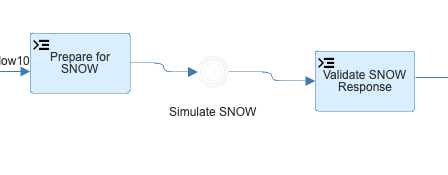
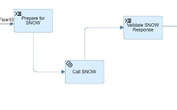
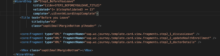
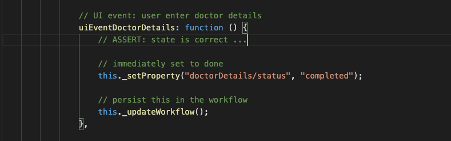

# How To Guide for Workflow Template Application

Chris Jobson
19th May 2021

## Table of Contents

[How to Build and Deploy the Application and Workflow](#how-to-build-and-deploy-the-application-and-workflow)

[How to Determine the Basic Structure](#how-to-determine-the-basic-structure)

[How to Modify the workflow with no difference to the sync points](#how-tomodify-the-workflow-with-no-difference-to-the-sync-points)

[How to Modify the application UI with no difference to the sync points](#how-to-modify-the-application-ui-with-no-difference-to-the-sync-points)

[How to Add new sync points](#how-to-add-new-sync-points)

# How to Build and Deploy the Application and Workflow

There are two approaches to building and deploying the application and workflow:

1. Create a single deployable package

2. Create separate workflow and application packages

## Create a single deployable package

You can create a single package, and then use the Workzone Package Deploy capabilities to deploy the application and workflow as a single unit.  Once deployed, the package can then be installed and made available for consumption in target workspaces.

The package creatino step requires the installation of certain package building tools.  To do this, you must first install the necessary `npm` packages at the root of the directory tree:

```
npm i
```

After this, you can use the command `npm run build-all` to build the necessary components.  This will perform a variety of steps, and the end result should be a file called `package.zip` which can then be uploaded as a content package into SAP Work Zone.

## Create separate workflow and application packages

Alternatively, the application and workflow can be build indepenently of each other and installed separately.  To achieve this, you will need to install certain NPM packages:

1. @ui5/cli
2. @sap/ui5-builder-webide-extension
3. mbt

Either install these globally or locally, as appropriate.

To create the workflow, first create an MTAR:

```
cd workflow
mbt build -s .
```

Then deploy the MATR:

```
cf deploy <path to MTAR>
```

This should deploy the workflow and it should be visible via the workflow definition monitor application in Workzone.

To create the application, first build the distribution:

```
cd card
ui5 build
```

This will create a new folder `dist`.  Then zip the distribution folder:

```
zip -r application.zip dist
```

The final zip file can then be uploaded in workzone via the UI Ibtegration card uploader.

# How to Determine the Basic Structure

xxx

# How to Modify the workflow with no difference to the sync points

The underlying workflow can be adjusted easily if there are no changes
to the sync points. In this case, simply add extra steps in the
workflow. For example, if we look at the example workflow, we see this:



This sequence of steps simply adds a 'delay' to the workflow to simulate
what might happen if we were to initiate an interaction with an external
system. Obviously, in an actual customer landscape this would be changed
to a more realistic scenario. For example, assume we want to create an
incident in Service Now, we could simply replace the above 'Simulate
SNOW' step with an actual external API call to the SNOW systems:



Alternatively, you could easily just add extra workflow steps in here --
including tasks for approval for example -- with no impact on the UI at
all.

The main thing to note is that when adding additional workflow steps,
provided the Intermediate Message event points are untouched, you can
add as many extra steps as you want.

# How to Modify the application UI with no difference to the sync points

Leaving the sync points alone means that the application and workflow
can be independently modified but still work together. Effectively the
application and workflow fit together and will continue to work.

In this case, simply add more UI steps, and after each UI step is
complete simply update the context object (no need to advance the
workflow unless required).

For example, let's add a new sub-step that simply captures additional
information. To do this, perform the following steps:

1)  Decide on a name for the sub-step (this will then be used as a
    property in the context object to place additional properties that
    are captured in the sub-step)

2)  Create an initialization definition for the property in the
    configuration init file.

3)  Add a new fragment corresponding to the sub-step

4)  Reference this fragment in the wizard step

5)  Add to the controller any event handers triggered by button's etc.
    added to the sub-step.

6)  If necessary, adjust any workflow scripts or service tasks/user
    tasks to reference the context object properties affected by this
    sub-step.

The new sub-step would be implemented via a fragment that then defines
the UI that binds to the new sub-step property. To make this concrete,
let's modify the existing template application by adding a sub-step in
main step 2 to capture the employee's doctor/physician details.

1)  Let's call the sub-step 'doctorDetails'

2)  Let's define this in the init for the context object:

    

3)  Let's create a new fragment 'step2_5\_doctorDetails.fragment.xml'
    
    

4)  Let's reference this from the wizard XML:
    
    

5)  Let's create the event handler in the controller:

    

    In this case, we simply persist the data in the workflow and do
    nothing else

# How to Add new sync points

In this case, you need to decide how to add new sync points that are
reflected in the UI and the workflow.
