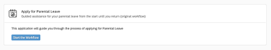
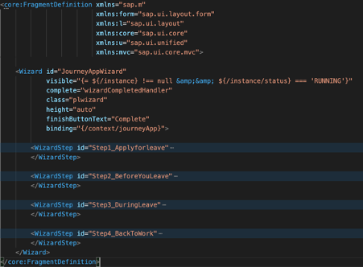
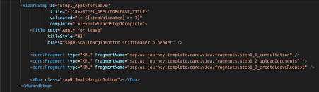
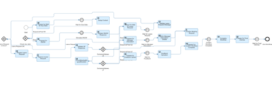

# Workflow Template Application

Chris Jobson
19th May 2021

## Table of Contents

[Introduction](#introduction)

[Technical Architecture](#technical-architecture)

[Business Scenarios](#business-scenarios)

[Application and Workflow Interaction Semantics](#application-and-workflow-interaction-semantics)

[Technical Application Structure](#technical-application-structure)

[Application Lifecycle/Events](#application-lifecycleevents)

[Underlying Model](#underlying-model)

[UI Layout](#ui-layout)

[UI Bindings](#ui-bindings)

[Controller Event Handling](#controller-event-handling)

[Workflow API Calls](#workflow-api-calls)

[Moving to the Next Wizard Step](#moving-to-the-next-wizard-step)

[Setting the Application State](#setting-the-application-state)

[Workflow](#workflow)

[Application Issues](#application-issues)

[Missing Workflow Features or Capabilities](#missing-workflow-features-or-capabilities)

[Next Steps](#next-steps)

[Appendix](#appendix)

# Introduction

This document describes the how the initial SAP Workzone Workflow
Template Application is constructed, and how to modify it and any
associated workflows to allow them to support a similar style of
scenario.

The document describes the characteristics of the workflow required to
work with this style of template application, and an overview of the
business scenarios they might work for.

# Technical Architecture

The application itself is delivered as a UI Integration Card, of type
Component. It is deployed to the SAP Workzone central repository. It
requires a workflow to be deployed into the associated Workflow engine
delivered with SAP Workzone (SWZ).

As a Component UI Card, it follows the structure of a typical UI5
Component application, and has a manifest file that conforms to the App
Descriptor schema. It can be built using standard tooling (for example,
in Business Application Studio), or built locally in a developer's local
environment. The deployment package is a simple ZIP file containing the
manifest, and the component resources (which as a minimum would consist
of a `Component.js` file, XML view files, and i18m resources, plus some
other support JavaScript files.

The workflow can be built and deployed using standard Workflow tooling
(again, for example, as hosted in Business Application Studio).

# Business Scenarios

This application and workflow pattern are best suited to what might be
described as 'wizard style' workflow use cases, where some end user is
led through a sequence of potentially long running steps, and where the
application might need to be restarted multiple times (for example,
because the browser context is reset, or page transitions in SWZ force
application restart).

Effectively, the end user of the application is on a 'journey', with
clear points on the journey requiring input from the user, and requiring
validation by the workflow. Because the application can be restarted at
any time, the application must be able to determine each time it is
restarted where on this journey the end user is. The application assumes
that the workflow itself maintains state properly and behaves with
certain characteristics (to be explained in detail below).

An example of such a scenario is something like applying for Parental
Leave.

When considering these scenario styles, it is worth looking at how the
application and workflow engine interact. Normally, with a 'pure'
workflow approach, the workflow engine coordinates steps and
periodically will create user tasks (such as an approval) that require
user interaction. These tasks are presented in the Inbox application. In
addition, the workflow engine might make service requests, or wait for
messages from 3^rd^ party systems. Also, the workflow definition can
determine what steps to execute next, and use conditional or parallel
branching features to start new steps etc.

With the Template Applicate approach, the relationship between the
application and the workflow instance needs to be understood clearly.
Here, the application 'synchronises' with the workflow at well-defined
points, with the details of what happens between these sync points being
irrelevant to the application. The application's UI is also not driven
directly by the workflow (as opposed to the UI displayed for user tasks
that the workflow might be creating). So there is a complete decoupling
of the application UI and the workflow: the workflow effectively acts as
a sort of persistence layer for the application, and the semantics of
this persistence layer is basically the interface between the
application and the workflow.

# Application and Workflow Interaction Semantics

The Application and the Workflow need to co-exist, and this requires the
workflow to exhibit certain characteristics in order to guarantee that
the application can correctly synchronize against it when necessary.

Also, at this point it is worth defining a few concepts with regard to
workflows.

***Workflow Definition***: The uploaded definition of the workflow as
created in the workflow tooling, describing the behaviour of the
workflow, such as interactions with other systems/services.

***Workflow Instance***: A particular invocation of a workflow, for a
specific user. A workflow definition may have potentially many
instances, for many users (and sometimes many instances for a single
user). Instances can be in various states (RUNNING, COMPLETED,
ERRONEOUS, etc.)

***Workflow Context***: An object (defined in JSON) that contains
'state' used by the workflow instance. This state is specific to this
workflow definition, and unique to this instance. Typically, for a
workflow definition the schema of the context object is well defined and
handled consistently through the steps of the workflow.

One crucial component of the workflow that the application assumes
exists is the workflow 'context' object -- the significance of this will
be explained in detail below.

Whenever the application starts it needs to determine the following:

1.  For a specific workflow definition, is there an active instance that
    can be queried?

2.  If so, what state is it in (Running, In Error, Complete etc.)

3.  What is the current state of the context object?

Other aspects of the workflow also need to be clearly understood:

-   Is the workflow definition (at a business level) designed to have at
    most a single instance for a user running, or does it support
    multiple instances?

-   Does it only ever support at most one instance for a user over all
    time, or can users trigger instances sequentially, or in parallel?

-   Who is responsible for creating the workflow instance?

In the case of this template application, **as it stands right
now**, the application assumes the following:

1.  The workflow transitions through a fixed number of well-defined
    states and does not support parallel or conditional branching in
    which state transitions might vary significantly from instance to
    instance (but again, see below for more details on this and how the
    restrictions might be lifted). A number of these states are what can
    be termed 'synchronisation points' (defined in more detail later)

2.  Only the application should initiate the workflow.

3.  Only the application 'moves' the workflow through the well-defined
    synchronisation points.

As mentioned above, some of these restrictions are probably not
realistic and the document will discuss how they can be relaxed
appropriately.

With the above in mind, the application will do the following:

-   On restart, it always queries the workflow APIs to determine if
    there is a matching workflow instance in a state of RUNNING,
    ERRONEOUS, SUSPENDED. It will ignore instances that are CANCELED or
    COMPLETED. SUSPENDED instances are displayed (crudely as of now) in
    the UI of the application -- the assumption is that some external
    person/system would restart them. In practice, the application needs
    to probably support a way of reporting this to some interested
    party. Once the workflow is pushed back to RUNNING the assumption is
    the instance is behaving normally again. If in ERRONEOUS state,
    again the application shows this (crudely). It would be possible to
    potentially retry the failed step, but this would be very
    scenario-specific and potentially difficult to code reliably. As of
    now the application allows the user to terminate the workflow (and
    start again). See later for more detail on how this could be
    enhanced.

-   If no instances are found, the application provides a starting UI,
    with the wizard steps reset to the initial state.

-   If a single instance is found (or the users selects from more than
    one), in a RUNNING state, the application uses the current workflow
    context to set up the UI. In general, the UI uses model binding to
    ensure that it displays content based on the current workflow state
    as presented in the context object.

-   If multiple instances are found, the UI presents a list of them to
    the user, who can then chose the appropriate one.

-   The context object is setup in a specific way, and the application
    relies on this for consistent behaviour. See the later section for
    details on the technical schema used for the context object, and why
    it is setup in this way.

-   One important thing determined from the context is the current
    wizard step. The application uses an XML view definition that
    includes the sap.m.Wizard and sap.m.WizardStep controls. These rely
    on the concept of a 'current step', and also whether an individual
    step is 'validated' or not. The context object stores this
    information that allows the application on restart to ensure that
    the correct current step is shown, and whether a particular wizard
    step is 'validated' or not: this will hide or show the 'Next' button
    that allows the application to move to the next step.

-   Another important property extracted from the context is one that
    indicates whether the workflow has reached a synchronisation point
    or not. Note that workflows can be long running in nature -- for
    example, external services might take time to respond, or there may
    be blocking user tasks (targeting for example, the application
    user's manager or 3^rd^ parties such as HR reps etc). As a
    consequence, the application needs to know if the workflow is ready
    to be moved to the next step or not, which typically means providing
    a modified context object. Knowing of the workflow is ready to
    receive a modified context object is determine by properties in the
    context object itself returned when the workflow instance is
    queried.

-   If the workflow is not at a synchronisation point, typically this
    means the application should wait until the sync point is reached.
    As of now, this is done via a simple polling loop, but this really
    needs changing into a better notification-based approach.
    Effectively, the application waits until the workflow reaches a
    suitable synchronisation point.

-   Once the UI is setup, the user can interact with it.

-   The user can trigger events by clicking on appropriate UI controls.
    These might then upload a modified context object to the workflow,
    triggering a new step.

# Technical Application Structure

The application is a normal UI5 application, using standard UI5
components and design patterns.

It has the following overall structure:

-   UI Integration Card

-   Component

-   XML View

-   Controller

-   Model

-   `manifest.json`

-   I18n properties

## UI Integration Card

The application is delivered to SAP Work Zone as a UI Integration Card.  This is defined in the file `manifest.json` via the property `sap.app/type`, which should be the string `card`.  In this case, we are deliveringn the appliucation as a `Component` card, so this card type is set via `sap.card/type`.

The application has two sets of property that determine the title and description that will be available in SAP Work Zone.  The first set are under `sap.app/title` and `sap.app/description`: these determine the title and description visible to the administrator of SAP Work Zone.  They can be internationalised using a property file under `i18n/i18n_<language>.properties`.  For example, to set English title and decsription, ensure the file `i18n_en.properties` exists with the necessary English strings.  See this link for some more details on internationalising your application:

https://sapui5.hana.ondemand.com/1.36.6/docs/guide/df86bfbeab0645e5b764ffa488ed57dc.html

The second set of properties that are relevant to naming and describing the application are those in the UI Integration Card section.  These are displayed to the end user when the Card is rendered in a workplace.  These are defined under `sap.card/header/title` and `sap.card/header/subTitle`, and an optional icon defined in `sap.app/header/icon/src`.

Also defined under `sap.card` are configuration values relevant to the runtime execution of the application.  These are defined via `sap.card/configuration`, and consit of two basica types: 

1. destinations used by the application
2. parameters used to control the behaviour of the application

To define destinations, use the syntax:

```
{
    ...
    "sap.card": {
        "configuration": {
            "destinations": {
                "<logical name of destination>": {
                    "name": "<default value to use>"
                },
                ...
            }
        }
    }
    ...
}
```

When the company administrator configures the UI Integration Card, the destinations will be mapped to *actual* Cloud Foundry destinations (defined at the sub-account level).

Within the application, you can then resolve the path that the destination is resolved to in code:

```
        ...
        this._ownerComponent = this.getOwnerComponent();
        this._card = this._ownerComponent.card;

        // resolve destinations
        Promise.all([
            this._card.resolveDestination("mySFDestination"),
            this._card.resolveDestination("myJAMDestination"),
            this._card.resolveDestination("myCMISDestination")
        ]).then((results) => {
            // we have resolved destinations
            this._sfDest = results[0];
            this._jamDest = results[1];
            this._cmisDest = results[2];
            ...

```

Then you can use the resolved URLs to access the necessary destinations.

Parameters can be passed to the application via the `parameters` section:

```
{
    ...
    "sap.card": {
        "configuration": {
            "parameters": {
                "userId": {
                    "value": "{context>sap.workzone/currentUser/id/value}",
                    "type": "string",
                    "label": "User ID"
                },
                "userName": {
                    "value": "{context>sap.workzone/currentUser/name/value}",
                    "type": "string",
                    "label": "User Name"
                },

            }
        }
    }
    ...
}
```

In this example, we have two parameters (`userId` and `userName`) which are set to values extracted from a context when the card is rendered in the workplace.  The synatx to extract `context` values is

```
    {context>sap.workzone/<context object>/<attribute>/value}
```

Three context objects are available:

1. `currentUser` - with attributes `id`, `name`, `email`
2. `currentWorkspace` - with attributes `id`, and `name`
3. `currentCompany` - with attributes `id` and `name`

If you want tro provide additonal parameters, simply add them to the set of parameters using this syntax:

```
{
    ...
    "sap.card": {
        "configuration": {
            "parameters": {
                "<name>": {
                    "value": "<default value>",
                    "type": "<type>",
                    "label": "<label for configuration>"
                },
                ...
            }
        }
    }
    ...
}
```

The `label` is used in the configuration screen to identify the parameter.  The `<default value>` is used unless the configuration overrides this.  The `type` can be `string` or `enum`.

## Component

The UI5 Application is a straightforward UI5 Component-based application.  It consists of a `Component.js` file, which is used to initialise and configure the application, an XML View (the root of this is defined in `Main.view.xml`), a controller (`Main.controller.js`) and a JSON model.

## XML View

The application's view is defined using an XML view definitions,
contained in the file `Main.view.xml` (the view name is defined in
`manifest.json`).

The top level view is basically a `sap.m.Wizard control`, with wizard
steps defined through `sap.m.WizardSteps`.

Each WizardStep includes sub-steps, each of which is defined in a
separate 'fragment' named after the sub-step.

Each fragment then defines the UI for the relevant sub-step, using a
simple XML view definition.

For more details of how the XML view layout is used to drive the UI, see
the later section on the UI Layout.

## Controller

As usual for XML view-based Components, the application has a
controller, `Main.controller.js`. The name of the controller is defined in
the Main.view.xml file. The controller is used to handle UI events
(typically from the UI control buttons), and trigger workflow API calls
as defined below.

## Model

The model is the context object, as described previously. An initial
definition of the model is provided in `config.js`.

## manifest.json

The manifest file (`manifest.json`) contains the normal definitions used
to define overall application capabilities and properties. This includes
(as a minimum):

-   application version

-   application name and title/sub-title

-   SAP UI technologies uses and dependencies

-   Root view name (Main)

-   That we are using SAP UI Integration Card technology to 'package'
    this component

-   Location of i18n properties

## I18n Properties

The usual i18n resource properties used to support translation are
provided.

# Application Lifecycle/Events

The lifecycle of the application is managed through the controller, and
follows this pattern:

-   On application start-up, initialise state

    -   Query UI Integration Host for parameters/destination
        configurations

    -   Query workflow for any running instance(s)

-   Listen for UI events (workflow is 'stable' -- at a synchronisation
    point)

    -   Once initialised the application will wait for UI events driven
        through event handlers

-   Polling Mode (workflow is not 'stable' -- not yet at a sync point)

    -   If the application is waiting for the workflow to move to a
        'stable' position, it will poll for the current workflow state

# Underlying Model

The UI is bound to a model, which consists of the following main
objects:

1.  Context Object

2.  Instance ID

3.  Definition ID

These are described here in more detail.

## Context Object

As mentioned above, the context object is extremely important as it
provides the means by which the application and the workflow interact
with each other.

The application expects the context object to be structured as follows:

```
{
  "context": {
    "<application specific name>": {
      "state": "<state>",
      "readyForMessage": null | "<message>",
      "currentStep": <step number>,
      "stepValidated": <step validated>,
      "progress": "<progress message>",
      "<substep>": {
        "visible": true | false,
        "status": "open" | "completed" | "inprocess" | "error",
        ... additional substep-specific properties
      },
      ... additional scenario specific content
    }
  }
}
```

The application always interacts with a (complex) context property that
is unique to the application. In the sample template application, this
is journeyApp. When the context is retrieved from the workflow, these
properties allow the application to determine:

-   Is the workflow waiting for a message (readyForMessage is non-null
    and contains the message the workflow is expecting)?

-   What is the current step wizard step (currentStep). This is an
    integer that the application uses to set the Wizard current step to.

-   Whether a wizard step is validated or not (stepValidated). This
    indicates which steps have so far been validated. The assumption is
    that they are validated one after another, so typically this would
    be the same as currentStep or one less but could be theoretically
    higher than the current step if the application wants to validate
    steps but not move the wizard forward.

-   The state property is used by the application to set up the UI
    appropriately. Often this does not affect anything as the context
    object will have everything the application needs, but there might
    need to be additional steps performed by the application once this
    state is reached.

-   Additional properties are also provided to control the behaviour of
    the 'sub-steps'. Each 'sub-step' uses two properties: visible and
    status. These are bound to properties in the view to either reveal
    the UI for the sub-step (through the visible property) or to control
    behaviour of the controls and embedded icons etc. in the UI (via the
    status property). In addition, each sub-step may have
    scenario-specific properties that are used in the UI and supplied to
    the workflow.

-   The workflow itself may use other properties in the context (outside
    of the application specific object) for its own purposes. The
    application specific section is designed to provide an area for the
    application and workflow to interact.

## Instance Object

When we have a valid workflow instance associated with the UI, this
object contains the instance status and its ID. The framework will set
this automatically as a result of calling the workflow APIs. Its
structure looks like:

```
{
  "instance": {
    "id": <ID of the instance, as returned from the workflow engine>,
    "status": <status of the instance: RUNNING, ERRONEOUS, SUSPENDED>
  }
}
```

## Definition ID

This contains the workflow definition ID, which is 'burned' into the
application, and allows us to locate the relevant workflow instance.
This is typically a string, such as 'parentalLeave'.

# UI Layout

The UI is at its center a Wizard control (sap.m.wizard). For more
details of this control, see this
[link](https://sapui5.hana.ondemand.com/#/entity/sap.m.Wizard). In the
context of this Guided Experience, we are using only a subset of
features. Primarily, we assume a linear flow (no branching support).

## Basic Guidelines

One of the main tasks with the development of the application is to map
the steps required to complete the Guided Experience into screens that
are navigated through using the wizard control. The basic concept is as
follows:

-   Split the experience into a set of major 'steps', which are closely
    related.

-   Each 'step' can itself consist of a number of 'sub-steps', which may
    be used to capture pieces of information relevant to the main
    'step'.

-   After completing each 'step', the user can then advance to the next
    (wizard) step.

Typically, each 'sub-step' is a form that collects information. Each
'sub-step' has an (optional) button (sap.m.Button) associated with it
that is used by the use to signify that the information required for the
step has been provided. The 'sub-step' is associated with a collapsible
panel (sap.m.Panel) that will hide the 'sub-step' when done (the user
can always unhide it later to reveal the content). Hiding the 'sub-step'
allows the user to visually concentrate on the next step, but they are
able to review the supplied data (and any associated status) at will. If
the button is not present, the assumption is that this 'sub-step' is
providing information only -- so it might have links to external
resources etc. It is still embedded in a panel, that is collapsible, so
the user can hide the contents if required. The panel is also hidden
until the 'sub-step' is ready. This keeps the focus on the current
'sub-step': as each 'sub-step' completes, the next panel is revealed,
and the current panel collapsed.

Once all 'sub-steps' are completed, the wizard can be moved to the next
main wizard 'step'. The UI bindings associated with each 'sub-step' are
setup such that once all required 'sub-step's are complete, the wizard
'step' control is enabled. This allows the experience to control the
progress: progress to the next step is only possible once each main
'step' is fully complete. It is possible to control (at the model level)
the status of each 'step' and enable the wizard to enable the 'next'
button.

It is important to note that the UI is **purely data-driven**:
each 'sub-step' and wizard 'step' is bound to data elements that
determine its status. The button has bindings that control its
visibility, enablement and type (emphasized or not). And also, it should
be remembered that the state is completely captured in the workflow
context. This is the basic means by which the UI can refresh itself
correctly whenever the user re-visits the UI. On app restart/refresh,
the first thing the app will do is refresh the workflow context, and
this allows the app to render the current state of the UI properly.

## Structural Composition

As mentioned in the introduction, the UI is defined via an XML view
definition. For more details on XML view definitions in UI5 see this
[link](https://sapui5.hana.ondemand.com/#/topic/91f292806f4d1014b6dd926db0e91070).
The top-level view is basically split into a number of sections:

1.  A 'start' section that is only displayed when the application is in
    its initial state

2.  A 'choose' section that allows the end user to select from a number
    of workflow instances in the case where the user might have multiple
    instances to choose from.

3.  The main 'wizard' section which is displayed when the app has been
    initialized

4.  Further 'error' or other sections that are displayed when the app
    has entered an error state or other state that means it is no longer
    'active'.

Each of these sections are encapsulated inside a 'fragment', which
defines the actual behaviour.

```
<mvc:View xmlns="sap.m"
          xmlns:form="sap.ui.layout.form"
          xmlns:l="sap.ui.layout"
          xmlns:core="sap.ui.core"
          xmlns:u="sap.ui.unified"
          xmlns:mvc="sap.ui.core.mvc"
          controllerName="sap.wz.journey.template.card.controller.Main"
          xmlns:html="http://www.w3.org/1999/xhtml">

    <!-- display start UI -->
    <core:Fragment type="XML" fragmentName="sap.wz.journey.template.card.view.fragments.start" />

    <!-- display main wizard UI -->
    <core:Fragment type="XML" fragmentName="sap.wz.journey.template.card.view.fragments.wizard" />

    <!-- handle error / dismiss cases -->
    <core:Fragment type="XML" fragmentName="sap.wz.journey.template.card.view.fragments.dismiss"/>
    <core:Fragment type="XML" fragmentName="sap.wz.journey.template.card.view.fragments.inError"/>
    <core:Fragment type="XML" fragmentName="sap.wz.journey.template.card.view.fragments.isSuspended"/>

</mvc:View>
```

The following sections describe this in more detail.

#### Start

The first screen the user sees looks like:



This is defined in the fragment start.fragment.xml:

```
<core:FragmentDefinition xmlns="sap.m"
                         xmlns:form="sap.ui.layout.form"
                         xmlns:l="sap.ui.layout"
                         xmlns:core="sap.ui.core"
                         xmlns:u="sap.ui.unified"
                         xmlns:mvc="sap.ui.core.mvc">

    <VBox visible="{= ${/instance} === null }"
          class="sapUiResponsiveMargin">

        <Text text="This application will guide you through the process of applying for Parental Leave" />

        <Button id="startWorkflow"
                class="sapUiSmallMarginTop"
                type="Emphasized"
                visible="true"
                enabled="true"
                press=".uiEventStartWorkflow"
                text="Start the Workflow" />

    </VBox>

</core:FragmentDefinition>
```

This fragment will display a UI control that is visible **[only if no
workflow instance is found]{.ul}** (available via the model property
instance). This is done by setting the VBox visibility via

```
visible="{= ${/instance} === null }"
```

As a result, the user will see this whenever there is nothing active; as
soon as we have an active workflow, we no longer display this control.

The user has only one option: to start the workflow, which results in
calling the uiEventStartWorkflow method in the controller. It is up to
the controller now to handle the necessary steps to initiate the
workflow and perform any other housekeeping required (see other sections
describing the controller functionality). This event handler method
would probably just create a new workflow:

```
// UI event: start the workflow
uiEventStartWorkflow: function () {
    this._createWorkflow("receivedConsultation");
},
```

Once the workflow is created, the UI will bind to the updated model, and
this UI will be replaced with the starting wizard step.

#### Choose

This UI component is only displayed when the application detects
multiple workflow instances that match the query characteristics. If
this is the case, the UI displays the list of instances, and allows the
user to select the appropriate one.  The view definitiono for this is delivered in `choose.fragment.xml`.

#### Dismiss

The dismiss UI happens after the workflow is done, and handles the final
cleanup. It is handled through the fragment `dismiss.fragment.xml`. The
code allows the user to indicate that resources allocated during the
workflow can be removed.

#### Error/Suspended

If the application ends up in an error or other non-active state, the
appropriate fragment here is used to display the UI. For example, if the
application ends up in an error state, as indicated by the status
property having the value ERRONEOUS, we active this XML, as defined in
the `inError.fragment.xml`:

```
<core:FragmentDefinition xmlns="sap.m"
                         xmlns:form="sap.ui.layout.form"
                         xmlns:l="sap.ui.layout"
                         xmlns:core="sap.ui.core"
                         xmlns:u="sap.ui.unified"
                         xmlns:mvc="sap.ui.core.mvc">

    <Panel id="InError"
           expandable="false"
           expanded="true"
           width="auto"
           backgroundDesign="Transparent"
           binding="{/instance}"
           headerText="The Workflow is in Error"
           visible="{= ${status} === 'ERRONEOUS'}">

        <VBox class="sapUiSmallMarginBottom">

            <Text class="sapUiSmallMarginTop successtext"
                  visible="true"
                  text="{lastErrorMessage}"/>

            <Button id="TerminateWorkflow"
                    type="Emphasized"
                    class="sapUiSmallMarginTop"
                    text="Terminate Workflow"
                    press=".uiEventTerminateWorkflow"
                    visible="true"/>

            <Button id="RestartWorkflow"
                    type="Emphasized"
                    class="sapUiSmallMarginTop"
                    text="Restart Workflow"
                    press=".uiEventRestartWorkflow"
                    visible="true"/>

        </VBox>

    </Panel>

</core:FragmentDefinition>
```

This renders a panel whose visibility is driven by

```
visible="{= ${status} === 'ERRONEOUS'}"
```

A similar approach is taken with the

#### Wizard

This is where the main UI is defined. See `wizard.fragment.xml`. The
wizard is visible if the instance is active and in the RUNNING state.

```
visible="{= ${/instance} !== null &amp;&amp; ${/instance/status} === 'RUNNING'}"
```

Note that only one of the start, error, dismiss or wizard fragments will
be shown at one time.

If the workflow is active and running (as opposed to in error or another
state), then the wizard will be rendered (it will have the visible
property set to true). The wizard state is reset from the workflow
context, and the current step and sub-step is displayed accordingly.

The current wizard step is determined from the currentStep property. The
controller is responsible for setting the wizard to the right step
whenever it retrieves the workflow context:

```
// set the wizard step

var wizard = this._view.byId("JourneyAppWizard");
var steps = wizard.getSteps();
var wizardStep = steps[appContext.currentStep];

wizard.setCurrentStep(wizardStep);
```

The wizard will then set the UI to reveal the correct wizard step based
on this. Once a wizard step is determined, we need to know if the step
is validated or not. A validated step reveals the Next button;
otherwise, the button is disabled. Whether a step is validated or not is
driven by the stepValidated property from the workflow context. When a
step is validated, this property is incremented by one. The controller
(based on UI event handling) determines when to increase the
stepValidated. Typically, this happens when all sub-steps are complete.
If all sub-steps are 'optional' you might decide to immediately increase
the stepValidated to allow the user to move to the next step.

```
<WizardStep id="Step1_Applyforleave"
            title="{i18n>STEP1_APPLYFORLEAVE_TITLE}"
            validated="{= ${stepValidated} >= 1}"
            complete=".uiEventWizardStep1Complete">
```

When the Next button is active/enabled, an event handler is triggered
when the user clicks it. In the above screen shot, the event handle
uiEventWizardStep1Complete is triggered when Next is pressed on
completing the first step.

This screen shot shows how the wizard might be laid out to include 4
main steps. To add a new step, simply insert a new wizard step.



Within each step, are various sub-steps. For example, in the example
shown, the first wizard step contains 3 sub-steps:



Each sub-step is structured in the same way:

1)  A containing VBox that is bound to the relevant sub-step property
    from the woirkflow context.

2)  The VBox is visible based on the sub-step status.

3)  A Panel that is expandable, but collapsed if the sub-step is
    complete.

4)  Under the Panel, some header icons that illustrate the state
    (complete, error, etc.)

5)  Also under the Panel, the various UI controls relevant to the
    sub-step.

6)  A Button that is used to indicate that the sub-step information is
    complete or the sub-step can be resolved. Typically, this Button is
    only enabled if all data etc. is provided.

7)  Status text that shows the sub-step state.

For example, this shows the structure of one sub-step:

```
<VBox id="Step1_substep1_consultation"
      class="substepMarginLeft substepActive"
      visible="{= ${visible}}"
      binding="{/context/journeyApp/consultation}">
```

-   This VBox is bound to the sub-step context object consultation.

-   It is visible if the property (in consultation) visible is true.

```
<Panel expandable="true"
       expanded="{= ${status} !== 'completed'}"
       width="auto"
       backgroundDesign="Transparent">

    <headerToolbar>

        <OverflowToolbar height="2rem" style="Clear">
            <Title text="{i18n>STEPS_APPLYFORLEAVE_STEPS_CONSULTATION_TITLE}"/>
            <core:Icon src="sap-icon://complete" class="size1" visible="{= ${status} === 'completed'}">
            <core:Icon src="sap-icon://accept" class="size1" visible="{= ${status} === 'inprocess'}"/>
            <core:Icon src="sap-icon://user-edit" class="size1" visible="{= ${status} === 'open'}"/>
            <core:Icon src="sap-icon://error" class="size1" visible="{= ${status} === 'error'}"/>
        </OverflowToolbar>

    </headerToolbar>
```

-   The Panel is expanded unless the status is completed

-   The relevant icon is shown based on the status
    (completed/inprocess/open/error)

```
<Button visible="{= ${status} === 'open' \|\| ${status} === 'error'}"
        type="{= (${dueDate} !== null &amp;&amp; ${termsAccepted}) ? 'Emphasized' : 'Default'}"
        enabled="{= ${dueDate} !== null &amp;&amp; ${termsAccepted} !== null}"
        class="sapUiSmallMarginTop substep"
        text="Sign Up Now"
        press=".uiEventSignUpNow"/>
```

-   The Button is visible if the status is open or error

-   The Button is enabled if certain properties are set (not null).

-   The same logic determines the type of the Button
    (Emphasized/Default).

```
<VBox class="substep"
      visible="{= ${status} !== 'open'}">

    <Text visible="{= ${status} === 'inprocess'}"
          class="sapUiSmallMarginTop successtext"
          text="You are in the process of being signed up. Please wait." />
    <Text visible="{= ${status} === 'error'}"
          class="sapUiSmallMarginTop successtext"
          text="It was not possible to sign you up: {errorMsg}" />
    <Text visible="{= ${status} === 'completed'}"
          class="sapUiSmallMarginTop successtext"
          text="You are signed up. Your HR department will contact you soon." />

    <HBox visible="{= ${status} === 'completed'}"
          class="sapUiSmallMarginTop">

        <Label text="Your HR Contact"
               required="false" width="120px"/>
        <Link href=[mailto:{processor/email}](mailto:%7bprocessor/email%7d)
              text="{processor/name}" />

    </HBox>

    <HBox visible="{= ${status} === 'completed'}" >

        <Label text="HR Ticket Number"
               required="false" width="120px"/>
        <Link href="{processor/hrticketdeeplink}"
              text="{processor/hrticketnumber}" />

    </HBox>

</VBox>
```

-   This VBox show status of the sub-step. It is visible based on the
    status property.

-   Various test items are shown based on what the status is. For
    example, if the status is error, then a suitable error message is
    shown.

# UI Bindings

The UI is intended to be driven through bindings to the context object.
UI5 supports the ability to define bindings between a model and the view
(either one way or two way). Here we use two-way bindings to allow the
UI to update the context object, and for the context object to update
the UI.

## Top Level Wizard View

The top-level wizard is defined in `Main.view.xml`, and, as mentioned
earlier, uses sap.m.Wizard to define basic wizard behavior. The
following bindings affect this:

### /instance/status

Used to determine if we actually have a running instance and whether to
display the basic UI

### /context/<app name>/stepValidated

Whereabouts in the sequence of steps we have progressed to

### /context/<app name>/state

Current workflow state

## Sub-Step View

Each sub-step is defined in its own fragment. Every sub-step follows
this pattern:

-   Containing VBox -- visibility based on sub-step visible property

    -   Expandable Panel -- expanded based on sub-step status property

        -   An embedded Header Toolbar

            -   Embedded icons shown based on sub-step status property

        -   Embedded VBoxs that contain labels and texts

        -   An (optional) embedded Button -- with event handler defined
            in the Controller

Text/values etc. shown in labels are bound to additional properties in
the sub-step context section.

The panel follows this pattern:

-   *Expanded*: whether the panel is expanded or not is determined by the sub-step status:
    ```
    expanded="{= ${status} !== 'completed'}" 
    ```

-   *Overflow Toolbar*: this contains a title for the sub-step, and icons that summarise the state of the sub-step.  There are icons for each possible status:

    ```
	<Title text="{i18n>STEPS_APPLYFORLEAVE_STEPS_CONSULTATION_TITLE}" />
	<core:Icon src="sap-icon://complete" class="size1" visible="{= ${status} === 'completed'}"/>
	<core:Icon src="sap-icon://accept" class="size1" visible="{= ${status} === 'inprocess'}"/>
	<core:Icon src="sap-icon://user-edit" class="size1" visible="{= ${status} === 'open'}"/>
	<core:Icon src="sap-icon://error" class="size1" visible="{= ${status} === 'error'}"/>
    ```

The (optional) button follows this pattern:

-   *Visibility*: the visible property is determined by the sub-step's status property:
    ```
    visible="{= ${**status**} === 'open' || ${**status**} === 'error'}"
    ```
    The button should be visible if the sub-step is in open or error
    status. Otherwise, the button is invisible.

-   *Type*: the type property is set to either Emphasized or Default,
    which is determined by whether all the necessary information has
    been provided in the accompanying form (and recorded in the model).
    For example, we might have:
    ```
    type="{= (${rating} !== null &amp;&amp; ${comment} !== null) ? 'Emphasized': 'Default'}"
    ```

-   *Enabled*: the enabled property is set in the same way as the type
    property, using model data provided in any accompanying form. For
    example (for the same button as the previous example):\
    ```
    enabled="{= ${rating} !== null &amp;&amp; ${comment} !== null}"
    ```

-   *Event*: there should be a UI event handler for each button that
    will be called when the button is pressed. The UI Event handler will
    be called when the button is pressed:
    ```
    press=".uiEventSignUpNow"
    ```

# Controller Event Handling

The View is managed through a Controller. This is responsible for
handling the UI events, and processing workflow state changes, and
ensuring that the model is updated properly.

Some of the controllers are designed to be implemented to suit the use case; others are 'standard' event handlers, which use boiler plate code to process events in a sstandardised way, and shoul dnot need to be modified.

## Standard Controller Event Handlers

The 'standard' following controller handlers are defined:

#### onInit

This is called whenever the UI is re-rendered (e.g. when the containing
page is navigated to, or the user refreshes the browser page etc.). It
is responsible for calling the workflow APIs to determine the current
state of the workflow.

##### _uiEventStartWorkflow

Called when we initiate the workflow (when there is no instance running).

##### _uiEventRestartWorkflow

Used to restart the workflow.

##### _uiEventDismissWorkflow

Used to clean up at the end and dismiss the UI and remove any artefacts etc.

##### _uiEventTerminateWorkflow

Used to terminate a workflow (not used in the example).

##### _uiEventChooseInstance

Called when a number of matching workflow instances are available.

##### _uiEventWizardStepComplete

Called whenever a wizard main step is complete.

## Use-case specific event handlers

These are provided by the template developer to suit the use case, and take the form:

#### uiEventXXX

Each UI event is handled through a matching event handler. Every time a
button is clicked, this calls the matching handler.

#### uiEventCleanupStep<N>

This is called whenever a main step event handler is clicked, and provides an opportunity for the developer to add any cleanup/setup code required.  This might involve setting sub-step statuses to 'complete' for example, or making sub-steps in the next wizard step to be visible.

#### appStatus<XXX>

When a workflow instance is loaded, an 'app status' event handler is called that allows the developer to perform any reuired setup (for example, making any sub-steps visible).  The actual name of the handler is determined by the status value returned by the workflow, via the `/context/<app name>/status` property value.

# Workflow API Calls

As described above, the application will need to query the workflow
APIs. This is done through a number of 'utility' or 'helper' functions
(that ultimately could be provided through a more officially support
library). These functions are:

```
_queryWorkflow

_createWorkflow

_advanceWorkflow

_updateWorkflow

_terminateWorkflow
```

These 'wrap' lower level calls that perform the actual API calls to the
workflow. Currently, the code that implements these lower level calls is
provided in the file `WFDataProvider.js` that ships with the app.

The higher-level calls are designed to be easy to use.

*Note that for each of these workflow API functions, the function call
itself returns immediately. The response from the workflow engine
triggers a callback via a promise chain -- this will result in a call to
an internal call back handler, which will update the data model etc.
automatically.*

## Query Workflow

During application initialisation, to query the workflow:

```
onInit: function () {

    ... initial setup

    // create context object
    var data = config.createContext(this._definitionId, mail, firstName, lastName);

    this._view.setModel(new WFModel(data));
    this._contextModel = this._view.getModel();

    // get the current workflow status
    this._queryWorkflow();
},
```

The implementation of the method will query the workflow engine for a
matching workflow instance or instances. If multiple instances are
found, the user will be shown a screen that asks them to select the
appropriate one.. As a result of calling this method, the following
model properties are updated:

```
/instance/id

/instance/status

/context/...
```

## Advance Workflow

To advance a workflow:

```
uiEventSetupLeaveDiscussion: function () {
    this._contextModel.setProperty("/context/journeyApp/discussLeave/enabled", false);
    this._contextModel.setProperty("/context/journeyApp/discussLeave/status", "requested");

    // move the workflow forward
    this._advanceWorkflow("receivedManagerDiscussionMeetingRequest");
},
```

## Create Workflow

To create a new workflow:

```
// UI event: user tapped signup now
uiEventSignUpNow: function () {
    this._contextModel.setProperty("/context/journeyApp/state", "init");
    this._contextModel.setProperty("/context/journeyApp/consultation/status", "inprocess");
    this._contextModel.setProperty("/context/journeyApp/consultation/processor", {
        hrticketdeeplink: "https://",
        hrticketnumber: "PL-4823",
        email: "hrparentalleave.consultants\@sap.com",
        name: "DL HR PL Consultants"
    });

    // create the workflow
    this._createWorkflow("receivedConsultation");
},
```

## Update Workflow

```
// UI event: user clicked Next on wizard step - move to the next step
uiEventWizardStep1Complete: function () {
    if (this._contextModel.getProperty("/context/journeyApp/currentStep") >= 1) {
        return;
    }

    this._contextModel.setProperty("/context/journeyApp/currentStep", 1);
    this._updateWorkflow();
},
```

## Terminate Workflow

To remove a workflow:

```
// UI Event: workflow terminated
uiEventTerminateWorkflow: function () {
    this._terminateWorkflow();

    // reset
    var data = config.createContext(this._definitionId, this._userDetails);
    this._view.setModel(new WFModel(data));
    this._contextModel = this._view.getModel();
    this.appStatusIsWFInitial();
},
```

# Moving to the Next Wizard Step

The application builds on the behaviour that comes with the sap.m.Wizard
and sap.m.WizardStep objects. The Wizard uses the property of the
overall wizard

```
currentStep
```

along with the individual wizard steps' property

```
validated
```

These properties are bound to the context object via the properties

```
/context/<app specific name>/currentStep

/context/<app specific name>/stepValidated
```

Typically, when a section of the wizard is completed, the application
(either directly via a UI event handler, or indirectly when setting
application state after loading a context object from the workflow) will
set the stepValidated property to a number greater than or equal to one
more than the step that has been validated. For example, if the current
step is 0 (the first step), and assuming that we have a non-validated
step (with stepValidated set to 0), and we wish to show the next button,
then we need to set stepValidated to 1. This is an example:

```
appStatusIsWFWaitingForManagerDiscussionRequest: function () {
    // expose the Next button for this wizard (we are done)
    this._contextModel.setProperty("/context/journeyApp/stepValidated", 1);
    this._contextModel.setProperty("/context/journeyApp/discussLeave/visible", true);
    this._contextModel.setProperty("/context/journeyApp/discussLeave/enabled", true);
},
```

Here we are setting the application state after the workflow has pushed
us to a new state, and now we set the stepValidated to 1 so now we
display the Next step for the first wizard element:

```
<WizardStep id="Step1_Applyforleave"
            title="{i18n>STEP1_APPLYFORLEAVE_TITLE}"
            validated="{= ${stepValidated} >= 1}"
            complete=".uiEventWizardStep1Complete">

    <Title text="Apply for leave" titleStyle="H3"
           class="sapUiSmallMarginBottom shiftHeader plheader" />

    <core:Fragment type="XML"
                   fragmentName="com.sap.wz.journey.Example.view.fragments.step1_1_consultation" />

    <core:Fragment type="XML"
                   fragmentName="com.sap.wz.journey.Example.view.fragments.step1_2_uploadDocuments" />

    <core:Fragment type="XML"
                   fragmentName="com.sap.wz.journey.Example.view.fragments.step1_3_createLeaveRequest" />

    <VBox class="sapUiSmallMarginBottom"></VBox>

</WizardStep>
```

This is the XML for the first wizard step, and the validated property is
bound to the stepValidated value through the expression binding syntax.

To actually move to the next step, we need to set the current step when
the user clicks Next:

```
// UI event: user clicked Next on wizard step - move to the next step
uiEventWizardStep1Complete: function () {
    if (this._contextModel.getProperty("/context/journeyApp/currentStep") >= 1) {
        return;
    }

    this._contextModel.setProperty("/context/journeyApp/currentStep", 1);
    this._updateWorkflow();
},
```

Here we set the current step to 1 (which is the second visible step)
when the user clicks on Next in the first wizard.

Also, having set the context object, it should also be pushed to the
workflow -- this can be done as shown with the _updateWorkflow call.

Summarising, these are the steps required:

1)  On completion of the sub-steps of a wizard step, set stepValidated
    -- this will reveal the Next button

2)  On user clicking Next, set currentStep -- this will move the UI to
    the next step in the wizard

3)  Save the context object -- so that this is remembered on application
    restart

# Setting the Application State

When a workflow is queried, its context object is used to set the
application state. If the workflow is waiting for a message (the
context's application-specific subproperty's readyForMessage is not
null), then the state-setting function `appStatusIsWF<workflow state>`
is called automatically. This allows the application to set any
additional properties etc. so that the UI can be rendered properly.

For example, this shows how to set certain properties that are bound to
the UI on setting the application status:

```
appStatusIsWFWaitForLeaveRequest: function () {
    this._contextModel.setProperty("/context/journeyApp/leaveRequest/visible", true);
    this._contextModel.setProperty("/context/journeyApp/uploadDocuments/visible", true);
},
```

Here we set the leaveRequest and uploadDocument (sub)properties so that
the UI can make these sections of the UI visible as soon as the workflow
reaches this point.

If the readyForMessage property is null, the code will not automatically
call an application status setter; instead, the workflow is regularly
polled until it reaches an intermediate message event, at which point
the readyForMessage property will be set to a non-null value.

Note that at any point, the application can call _updateWorkflow to
push a new version of the context object to the workflow. This is useful
if the application wants to persist the context object so that certain
UI changes are remembered.

# Workflow

## Overview

This is what the template workflow looks like:



The workflow is created and deployed as normal, but it needs to conform
to certain 'patterns' in order for the application to interact with it
properly. The workflow lifecycle looks like:

-   An initial create event that is triggered by the application when
    the user starts the workflow

-   Perform any initial setup and move to initial Intermediate Message
    Event

-   This allows the workflow to set any context-relevant properties that
    might be needed by the application to start the UI (such as value
    helps etc.)

-   Application will wait for the workflow to enter this initial message
    state, and then will expose UI that allows user to start the actual
    workflow proper

-   Now the application will send messages that conform to each
    intermediate message event

Note that initially there is no workflow (or technically, no workflow
'instance') -- as a result, queries for the workflow will fail, and the
application will revert to the 'initial' state. This will mean the UI
displays the 'start' screen, and when the user clicks on the 'start'
button, this will create the workflow instance.

The workflow instance will then do basic initial setup (via its first
step), and then move the first Intermediate Message Event point.

Note that workflow instances are identified via a variety of properties:

-   Definition ID

-   Business Key (in our example, the user's ID)

-   Status (RUNNING, ERRONEOUS, SUSPENDED)

-   Instance ID

If you have an instance ID, this can be used to uniquely identify a
workflow instance; otherwise, you need to use the definition ID,
business ID and status values to locate a matching workflow.

## Use of Intermediate Message Events

The application expects to send messages to the workflow when it is
waiting for a message. The application will achieve this through the API
call `_advanceWorkflow` -- this sends a message of a particular type to
the workflow. In order that the application can send the correct
message, and know that the workflow is waiting for such a message, the
context object is used as a means of synchronisation.

The workflow will set the property readyForMessage (of the
application-specific sub property) to either null -- indicating that the
workflow is not ready for a message -- or to a string indicating the
message expected. This is done in a workflow script event immediately
prior to the intermediate message event. In addition, the workflow will
set the state property to indicate what state the workflow is in. For
example, this might be the content of the script task prior to an
intermediate message wait event:

```
$.context.journeyApp.readyForMessage = "request_leave";

$.context.journeyApp.state = "waitForLeaveRequest";
```

Here we can see the workflow is indicating that it is now waiting for a
message (with the value request_leave) and it is in a particular state.
On the application side, when it queries the workflow, the application
will call the matching event handler

```
// set app state: we are ready to upload docs
appStatusIsWFWaitForLeaveRequest: function () {
    this._setContextProperty("uploadDocuments/visible", true);
},
```

This shows that the application now sets the visible property of the
uploadDocuments object to true. As a result, the sub-step that shows the
Upload Document UI can be shown, allowing the user to upload any
relevant documents:

```
<VBox id="Step1_substep2_uploadDocuments"
      class="substepMarginLeft substepActive"
      visible="{= ${visible}}"
      binding="{/context/journeyApp/uploadDocuments}">
```

# Application Issues

# Missing Workflow Features or Capabilities

## Error Handling

There is a significant issue regarding the handling of errors in the
workflow itself. If a workflow triggers a call to an external service,
and the service returns anything other than a 2XX response, the workflow
will move to an `ERRONEOUS` state. This is difficult to recover from as
the application must somehow determine the cause of the failure (which
might be technical or business related) and then provide an updated
context object and then force the workflow to re-execute the failed
step. There are no easy ways to handle this in a standardised way
currently, meaning that such failures are not really recoverable from in
the current version.

## Pre- and Post-Intermediate Message Event Processing

The workflow should set the context object appropriately before and
after an intermediate message event. It would be nice to define such
pre- and post-processing directly on the message event object, but
currently this needs to be defined through separate script events in the
workflow, which is messy and adds to a more confusing workflow
definition.

# Next Steps

1.  Integration with Business Rules Engine

2.  Document Storage Usage and Examples

3.  Value Helps

4.  Error Handling Improvements

5.  Tooling to help overall application layout

# Appendix

## Example GIT repos

UI5 Application <https://github.wdf.sap.corp/i063007/journeyCard.git>

Workflow <https://github.wdf.sap.corp/i063007/journeyWorkflow.git>
